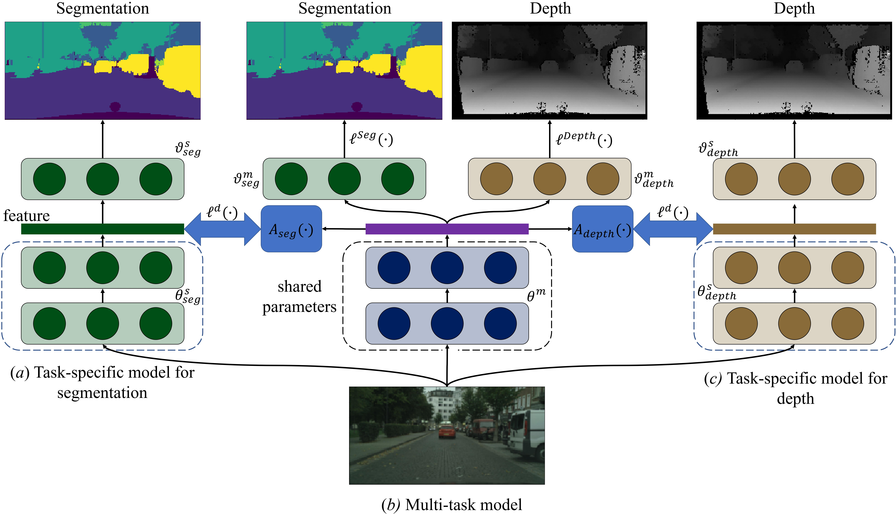

# Knowledge Distillation for Multi-task Learning
This is the implementation of [Knowledge Distillation for Multi-task Learning](https://arxiv.org/pdf/2007.06889.pdf) introduced by [Wei-Hong Li](https://weihonglee.github.io) and [Hakan Bilen](http://homepages.inf.ed.ac.uk/hbilen/index.html). We provide code for our method that performs semantic segmentation, depth estimation and surface normal estimation on NYU-v2 dataset using SegNet and MTAN. The repository also contains code for baselines which are compared in our paper.

